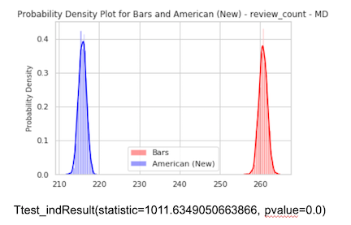
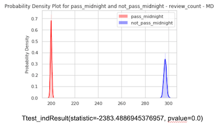

# Module 3 Project, July 17 2019

## Members
- Mindy Zhou
- Ngoc Tran

## Goals
### Use statistical insights to open a successful restaurant business in DC Metro Area
- Used Yelp Business Details API to obtain raw data 
- Cleaned raw data for Location, Cuisine, Price Range, and Hours of Operations analyses
- Target variables: review_count and rating 
- To find a lucrative restaurant business in DC Metro Area: 
  * Location (DC, MD, VA)
  * Cuisine
  * Price Range (>$$ or <=$$)
  * Hours of Operation (close before midnight or aftermidnight) 
- Provide a set of slides to present
- Provide Jupyter Notebook for technical audience with an emphasis on readability
- Detailed data cleaning and helper_functions.py files 

## Responsibilities
- Mindy: performed Locations and Price Range analyses
- Ngoc: conducted Cusine and Hours of Operations analyses

## Summary of files in the repository
* data folder
  - Yelp_API_Data_Retrieval.py: detailed code for Yelp API calls for raw data 
  - df_business_details.pkl: raw datafile for statistical analyses 
  - prepared dataframe for technical jupyter notebook
    * dc_restaurants_cuisine.csv
    * md_restaurants_cuisine.csv
    * va_restaurants_cuisine.csv
    * yelp_price_location.pkl
    * random_price.pkl
    * median_price.pkl
    * na_remove.pkl
* Data_Cleaning_for_Cuisine_and_Open_Pass_Midnight.ipynb 
  - detailed data cleaning for Cusine and Hours of Operations analyses  
* Data_Cleaning_for_Location_and_Price_Analysis.ipynb
  - detailed data cleaning for Location and Price analyses 
* Inferential_Statistical_Analysis_for_Restaurant_Business_in_DC.ipynb
  - Technical jupyter notebook for statistical inferential analyses 
* Lets_Open_A_Restaurant.pdf 
  - pdf version of the google presenation slide 
* helper_functions.py:  
  - contains data cleaning functions and inferential statistical functions 

## Results:  

* Start a restaurant business
  - Location:
      * Maryland part of the DMV Area
      
      
  - Cuisine:
      * Bars
      
          
  - Price Range:
      * $$$ - $$$$
      
      
  - Hours of Operation:
      * Close before midnight 
      
      

## Presentation
[Google Slide](https://docs.google.com/presentation/d/1_0Vv0jGHr5Q2WRlhGaqx2HtZ4rscA4FvQ08C6ktf-Gk/edit#slide=id.g5ecdd344ab_0_0)
